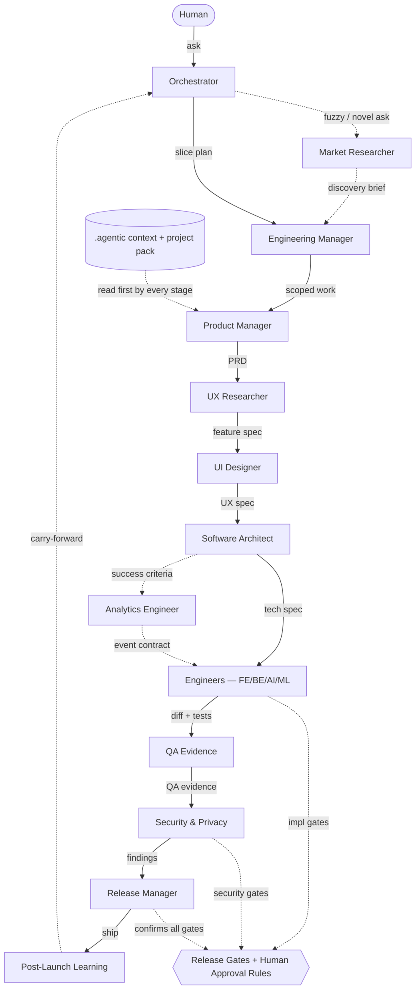
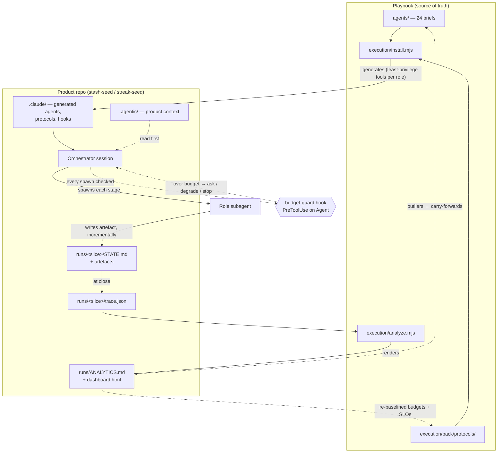

# Architecture & Data Flow

Start here. This is the map; the other docs are the detail.

## The problem this solves

A single general-purpose agent asked to "build the feature" holds the PRD,
the design, the architecture, the code, and the QA notes in one context
window — and degrades. This playbook is the alternative: a **pipeline of
narrow agents**, each with one job, passing **artefacts** to the next,
gated by a **control plane**, with a **human at the points that matter**.

So the "architecture" here is not services and databases. It's an
information-processing system:

- **Nodes** = agents (one brief each).
- **Edges** = artefacts — the data passed from one agent to the next.
- **Inputs** = the product's `.agentic/` context + a project pack, read by
  every agent.
- **Control plane** = release gates + human-approval rules that gate each
  transition.
- **Loop** = Post-Launch feeds the Orchestrator, which starts the next
  slice.

## View 1 — Lifecycle data flow

Edges are artefacts (the data); dotted edges are optional/parallel paths or
context reads. The control plane gates the transitions.

**How to read it:**

- A slice enters as a free-form **human ask** and leaves as a **shipped,
  reviewed, learned-from change**. The loop back from Post-Launch is what
  makes it a lifecycle rather than a line.
- Each agent reads only its **incoming artefact + the `.agentic` context +
  the project pack** — not the whole repo, not the prior conversation. That
  context discipline is why the role split actually saves tokens (see
  `OPERATING_MODEL.md`).
- The **Engineering Manager** compresses the pipeline for small slices
  (skip Market Research, collapse design) and records why.
- **Overlay roles** (Data Governance, AI Governance, Compliance Reviewer,
  FinOps, Tech Writer, SRE, Customer Success) attach to this flow when an
  enterprise/governance context is enabled — Compliance between Security and
  Release, SRE in production, Customer Success feeding Post-Launch. They are
  additive; a B2C MVP runs the flow above without them. See the overlay
  section of `AGENTIC_SDLC.md`.
- The **control plane** is not a stage — it's a gate on transitions. An
  artefact can't advance until its gate passes (`RELEASE_GATES.md`), and
  certain actions (send, deploy, destroy, new data processor) halt for a
  human (`HUMAN_APPROVAL_RULES.md`).

## View 2 — How the repo realizes it

Every architectural concept above maps to a folder. The repo *is* the
system definition.

| Path | Architectural role | Key contents |
|------|--------------------|--------------|
| `docs/` | Lifecycle definition + control plane | `AGENTIC_SDLC.md` (the pipeline), `AGENT_ROLES.md` (topology + handoffs), `RELEASE_GATES.md` + `HUMAN_APPROVAL_RULES.md` (control plane), `OPERATING_MODEL.md` (context discipline), this file (the map) |
| `agents/` | **Nodes** — one brief per agent | 24 role briefs: mission, inputs, outputs, decisions owned/not-owned, quality bar, handoff |
| `templates/` | **Artefact bus** — the message format between nodes | 22 fill-in artefacts; `AGENT_HANDOFF_TEMPLATE.md` is the envelope every handoff uses |
| `prompts/` | **Node instantiation** — how to invoke an agent | 20 copy-paste prompts, one per role |
| `project-packs/` | **Configuration** per product archetype | `b2c-saas`, `ai-agent-product`, `browser-automation-product`, `enterprise-saas-future` |
| `examples/` | A **captured run** of the whole pipeline | `saved-items-bulk-delete/` — one slice traced through every stage, with a sample `.agentic/` |
| `.agentic/` *(lives in the product repo)* | **Per-product context/state** read by every node | `PROJECT_CONTEXT`, `SAFETY_INVARIANTS`, `LOCAL_COMMANDS`, `CURRENT_MVP_STATUS` |
| `execution/` | **Runtime** — compiles the methodology into an executable pack | `install.mjs` (generates `.claude/` agents + protocols + hooks), `analyze.mjs` (renders analytics from telemetry), `hooks/budget-guard.mjs`, `pack/protocols/` (9 protocols) |
| `runs/` *(lives in the product repo)* | **Execution record + telemetry** | `<slice>/STATE.md` (durable, resumable), `<slice>/trace.json` (machine-readable), the stage artefacts, `ANALYTICS.md` + `dashboard.html` (generated) |

## View 3 — Execution & the feedback loop

Views 1–2 describe the *methodology*. This is the part that actually runs, and
it closes a loop: the playbook compiles into a product repo, runs there produce
telemetry, and the telemetry changes the playbook.

**How to read it:**

- **The playbook compiles.** `install.mjs` turns briefs + protocols into a
  runnable `.claude/` pack inside the product repo — agents carry per-role
  least-privilege `tools:`. *Caveat:* those restrictions only bind when the
  Orchestrator session is rooted **in the product repo**, where the generated
  agents are discoverable.
- **Cost is governed before it is spent.** The budget guard runs as a
  `PreToolUse` hook on every `Agent` spawn and asks the human when a spawn would
  exceed the slice's declared budget (`RUN_ECONOMICS.md`). It **fails open** by
  design — a cost control must never block legitimate work; release gates fail
  closed, convenience guards fail open.
- **Telemetry is data, not prose.** Each run emits `trace.json` alongside the
  human-readable `STATE.md`; `analyze.mjs` renders both human views from it.
  Author once, render many — the views are never hand-maintained, so they cannot
  drift from the record.
- **The dotted return edges are the point.** Detected outliers become
  carry-forwards that change *briefs*; measured cost re-baselines *budgets and
  SLOs*. That is what makes this a control loop rather than a pipeline with a
  dashboard bolted on.

## Under the hood

Three properties make the pipeline work:

1. **Artefacts, not chat.** Each agent's only contract is the artefact it
   reads and the artefact it writes. It doesn't need the conversation that
   produced its input. This is what keeps each node's context small.
2. **Gates fail closed.** A failed gate sends the slice back to the owning
   stage — never forward. The gates encode the failure modes that have bitten
   before (silent regression, approval bypass, logged secrets, runaway cost).
3. **The human is in the loop by rule, not by vibe.** A small, fixed list of
   actions always stops for explicit human approval. Everything else the
   agents are trusted to do within a slice.
4. **The system observes and governs itself.** Runs emit machine-readable
   telemetry; generated analytics flag their own outliers; budgets are checked
   before the spend, not reconciled after. When a measurement contradicts a
   target, the target is re-derived from evidence and the change is recorded —
   never quietly loosened to make a red thing green.

## What this is — and how we chose to capture it

This began as a **methodology** rather than a running system, and Views 1–2
capture it that way. That is now only half the story: `execution/` compiles the
methodology into a pack that really executes (generators, protocols, a
`PreToolUse` hook, telemetry, analytics), which is what View 3 draws. There is
still no deployment or container diagram, because the "runtime" is a developer
machine and a product repo, not a fleet.

We considered generating an interactive
knowledge graph (à la code-comprehension tools that parse source with
tree-sitter), but those target *code structure* — this repo is markdown
specs, so such a tool would find little to graph. Hand-authored **Mermaid**
(diffable, GitHub-rendered, evolves with the playbook) plus **tables**
captures the agent topology and data flow far more faithfully here, and
matches the repo's all-markdown ethos.

For the lifecycle stage-by-stage, see `AGENTIC_SDLC.md`. For who owns what,
see `AGENT_ROLES.md`. For a worked run, see `examples/`.
